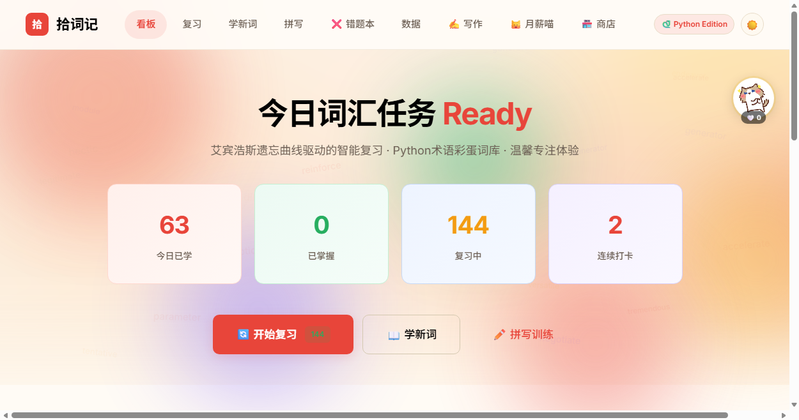
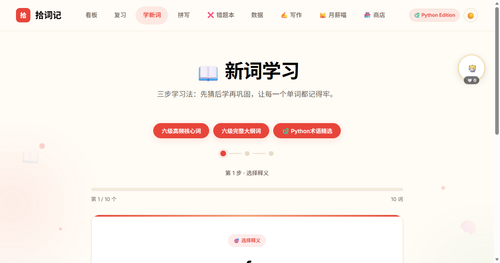
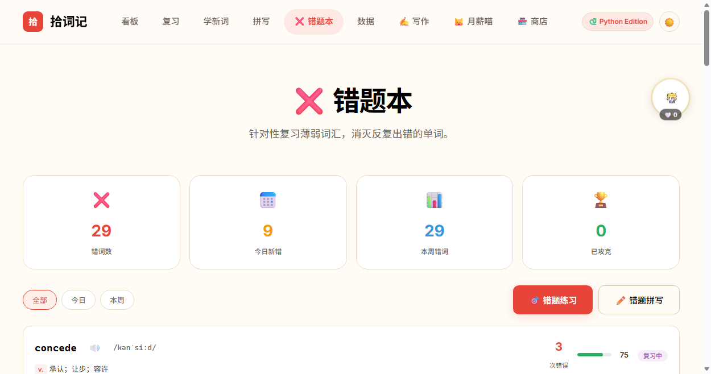
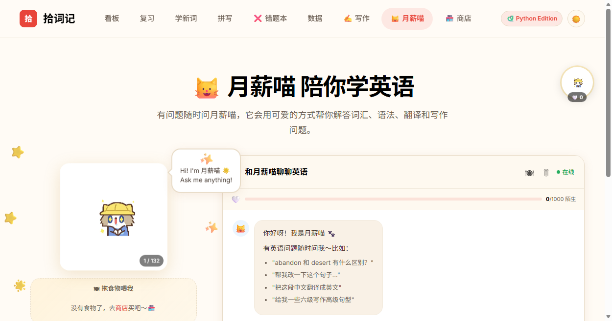
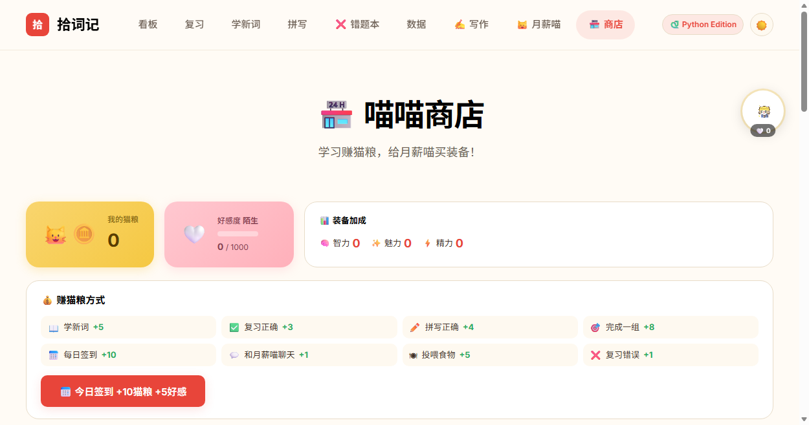
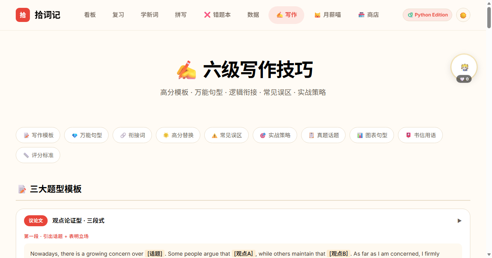
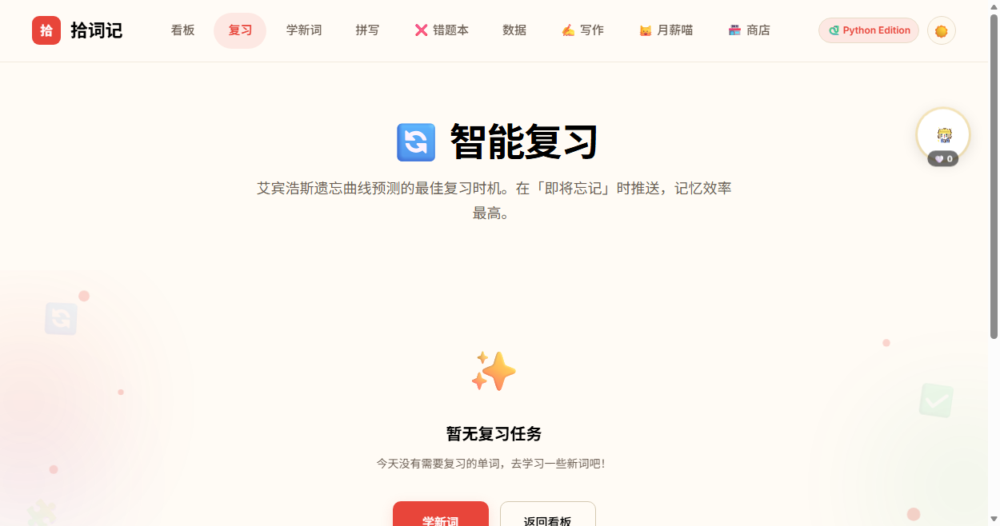
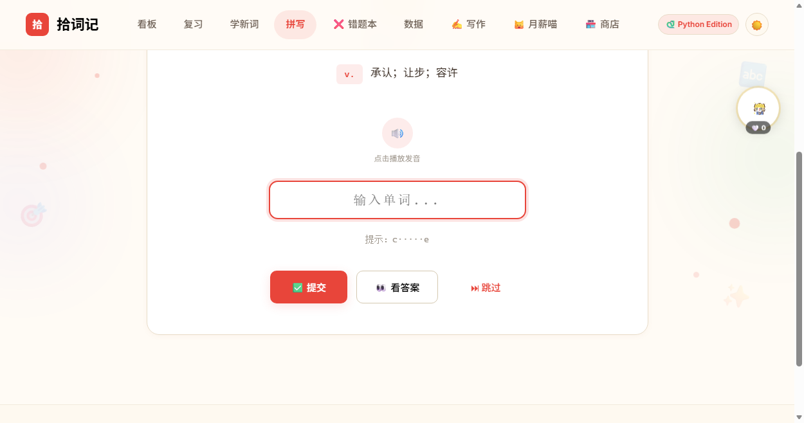
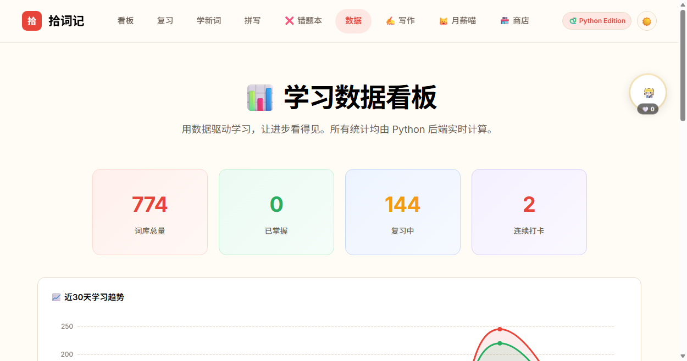

# 🐱 拾词记 · CET-6 词汇背诵工具

> 专为大学生六级备考设计的温馨背单词工具，Python 课程作业版

拾词记是一个基于 Flask 的六级词汇学习 Web 应用，融合了**艾宾浩斯遗忘曲线**间隔重复算法、三步学习法、AI 英语桌宠等特色功能，让背单词不再枯燥。

---

## ✨ 特色功能

### 📖 科学学习
- **三步学习法**：选择释义 → 详解巩固 → 自我评估，循序渐进
- **艾宾浩斯遗忘曲线**：智能安排复习时间，在最佳记忆点提醒复习
- **拼写训练**：针对薄弱词汇的深度拼写练习，拼错可重试
- **错题本**：专属错词收集，支持按时间筛选 + 选择题/拼写两种错题练习模式

### 🐱 月薪喵 · AI 英语桌宠
- 基于 DeepSeek API 的智能英语助手，随时解答词汇、语法、翻译问题
- 可拖拽投喂食物，好感度养成系统
- 全局悬浮小组件，任何页面都能和月薪喵聊天

### 🏪 喵喵商店
- 学习赚猫粮，给月薪喵买帽子、衣服、配饰和零食
- 不同食物有不同属性加成（智力/魅力/精力）
- 装备系统，穿戴后获得学习加成

### ✍️ 六级写作
- 5 种议论文模板（观点论证 / 利弊分析 / 问题解决 / 对比选择 / 名言哲理）
- 图表作文模板 + 书信模板
- 万能句型、衔接词速查、低级→高级替换表
- 常见误区提醒 + 30 分钟写作策略

### 📊 数据统计
- 学习热力图日历
- 掌握程度分布图
- 薄弱词汇排行
- 每日学习统计

---

## 📸 功能截图

<table>
  <tr>
    <td align="center"><b>🏠 看板</b></td>
    <td align="center"><b>📖 学新词</b></td>
    <td align="center"><b>❌ 错题本</b></td>
  </tr>
  <tr>
    <td></td>
    <td></td>
    <td></td>
  </tr>
  <tr>
    <td align="center">学习日历、错题速览、每日名言</td>
    <td align="center">三步学习法：选释义→详解→自评估</td>
    <td align="center">错词收集 + 选择题/拼写练习</td>
  </tr>
  <tr><td colspan="3"></td></tr>
  <tr>
    <td align="center"><b>🐱 月薪喵</b></td>
    <td align="center"><b>🏪 喵喵商店</b></td>
    <td align="center"><b>✍️ 写作技巧</b></td>
  </tr>
  <tr>
    <td></td>
    <td></td>
    <td></td>
  </tr>
  <tr>
    <td align="center">AI 对话、拖拽投喂、好感度养成</td>
    <td align="center">赚猫粮买装备和食物</td>
    <td align="center">5 种议论文模板 + 万能句型</td>
  </tr>
</table>

<details>
<summary>📸 更多截图</summary>

| 🔄 复习 | ✏️ 拼写训练 | 📊 数据统计 |
|---------|-----------|-----------|
|  |  |  |
| 间隔重复复习 | 针对薄弱词汇拼写 | 学习热力图与统计 |

</details>

---

## 🛠️ 技术栈

| 技术 | 用途 |
|------|------|
| **Flask** | Web 后端框架 |
| **SQLite** | 轻量级数据库，零配置 |
| **Jinja2** | 模板引擎 |
| **DeepSeek API** | AI 英语桌宠对话 |
| **ECharts** | 数据可视化图表 |
| **HTML5 Drag & Drop** | 拖拽投喂交互 |

---

## 🚀 快速开始

### 1. 克隆仓库

```bash
git clone https://github.com/soyorin01/recite-word-for-CET6.git
cd recite-word-for-CET6
```

### 2. 安装依赖

```bash
pip install -r requirements.txt
```

依赖列表：
- Flask 3.0+
- openai（用于 DeepSeek API 调用）
- python-dotenv
- Pillow（处理表情包素材过滤）

### 3. 配置环境变量

复制 `.env.example` 为 `.env`，填入你的 DeepSeek API Key：

```bash
cp .env.example .env
```

编辑 `.env`：
```
DEEPSEEK_API_KEY=your_api_key_here
```

> 💡 API Key 获取：前往 [DeepSeek 开放平台](https://platform.deepseek.com/api_keys) 注册并创建
>
> ⚠️ 如果不配置 API Key，其他功能正常使用，仅 AI 桌宠对话功能不可用

### 4. 启动应用

```bash
python app.py
```

访问 http://localhost:5000 即可使用 🎉

---

## 📁 项目结构

```
recite-word-for-CET6/
├── app.py                  # Flask 主应用（路由 + API）
├── models.py               # 数据模型（艾宾浩斯算法 + 查询函数）
├── requirements.txt        # Python 依赖
├── .env.example            # 环境变量示例
├── data/
│   └── cet6_words.json     # 六级词汇数据源
├── static/
│   ├── css/style.css       # 全局样式
│   └── pet_assets/         # 月薪喵表情包素材
├── templates/
│   ├── base.html           # 基础布局 + 全局系统（猫粮/好感度/桌宠）
│   ├── index.html          # 看板首页
│   ├── learn.html          # 学新词（三步法）
│   ├── review.html         # 复习
│   ├── spell.html          # 拼写训练
│   ├── mistakes.html       # 错题本
│   ├── writing.html        # 六级写作技巧
│   ├── stats.html          # 数据统计
│   ├── pet.html            # 月薪喵互动页
│   ├── shop.html           # 喵喵商店
│   └── word_detail.html    # 单词详情
└── README.md
```

---

## 🧠 艾宾浩斯复习算法

采用 7 级间隔重复策略：

```
间隔天数：1 → 2 → 4 → 7 → 15 → 30 → 90
```

根据答题表现动态调整：
- **答对**：熟悉度 +15，推进到下一级间隔
- **答错**：熟悉度 -20，间隔减半，加强复习频率
- **模糊**：熟悉度 +5，维持当前间隔

准确率低于 50% 的单词会被额外缩短间隔，确保薄弱词汇得到充分练习。

---

## 📝 词库说明

- **六级高频核心词**（`cet6_core`）：精选高频核心词汇
- **六级完整大纲词**（`cet6_full`）：覆盖六级大纲全部词汇
- **Python 术语精选**（`python_terms`）：编程相关英语词汇彩蛋 🐍

---

## 🤝 贡献

欢迎提交 Issue 和 Pull Request！

---

## 📄 许可证

MIT License
